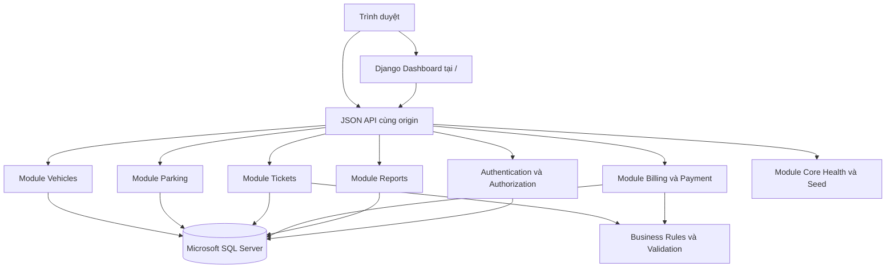
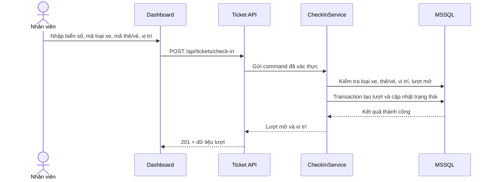
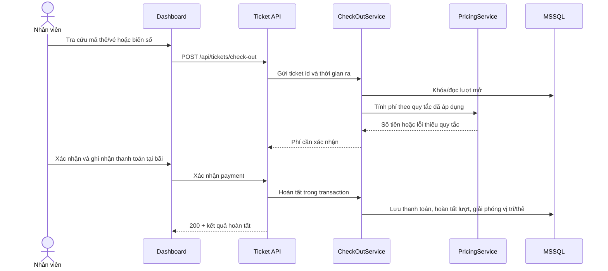

# Tài liệu thiết kế hệ thống

**Hệ thống:** Hệ thống Quản lý Bãi đỗ xe - Phiên bản nghiệp vụ cốt lõi
**Tài liệu:** 02 Design
**Phiên bản:** 1.0
**Ngày:** 2026-08-28
**Đầu vào:** `docs/01_requirements.md` (`STATUS: PASS`)

## 1. Nguyên tắc và quyết định thiết kế

- Thiết kế là mô tả logic, module, interface, dữ liệu và luồng; không phải source code hoàn chỉnh, DDL vật lý hay kế hoạch sprint.
- Chọn kiến trúc modular monolith Django: ít hạ tầng, phù hợp cấu trúc project hiện tại, nhưng tách module theo miền để có thể mở rộng.
- Django render dashboard tại `/`; các màn hình gọi JSON API cùng origin. `frontend/` chỉ là scaffold React/Vue và không thay thế dashboard hiện tại.
- MSSQL là cơ sở dữ liệu mặc định theo `NFR-TECH-002`; không dùng SQLite.
- AI/ALPR, camera, WebSocket, RFID, barie, IoT, thanh toán trực tuyến và vé tháng đều bị vô hiệu hóa trong phiên bản này. Các điểm mở rộng chỉ được ghi nhận để tránh thiết kế lại sau này, không tạo interface bắt buộc cho runtime hiện tại.
- Công thức giá cụ thể phụ thuộc `OQ-001`; thiết kế dùng một Pricing Engine nhận quy tắc đã được phê duyệt, không tự chọn block giờ/ngày/đêm khi chưa chốt.

## 2. System Architecture

### 2.1. Sơ đồ logic



### 2.2. Module và interface

| Design ID | Module | Trách nhiệm và interface chính | Requirement liên quan |
|---|---|---|---|
| DES-ARCH-001 | Django Project Shell | `config/settings.py`, `config/urls.py`, middleware, template rendering, static assets; định tuyến `/` và `/api/*`. | `NFR-TECH-001`, `NFR-TECH-003`, `FR-API-001` |
| DES-ARCH-002 | API Presentation | Serializer, view, status code, pagination, filter và error envelope; không chứa business rule phức tạp. | `FR-API-001`, `FR-LIST-001`, `NFR-USE-001` |
| DES-ARCH-003 | Domain/Application Services | Các interface sâu `CheckInService`, `CheckOutService`, `PricingService`, `TicketQueryService`; thực hiện invariant trong một giao dịch nghiệp vụ. | `FR-TICKET-001..005`, `FR-PRICE-002`, `FR-PAYMENT-001`, `NFR-DATA-001` |
| DES-ARCH-004 | Persistence Adapter | Django ORM trên MSSQL; transaction, truy vấn trạng thái và uniqueness được đặt ở lớp dữ liệu phù hợp. | `NFR-TECH-002`, `NFR-DATA-001` |
| DES-ARCH-005 | Authentication/Authorization | Session/JWT theo cấu hình dự án; permission cho ACT-001 và ACT-002; từ chối trước khi gọi service. | `FR-AUTH-001`, `FR-AUTH-002`, `NFR-SEC-001` |
| DES-ARCH-006 | Observability Adapter | Log sự kiện nghiệp vụ, lỗi đã chuẩn hóa và correlation/request id; không ghi mật khẩu, token hoặc dữ liệu nhạy cảm không cần thiết. | `NFR-SEC-001`, `NFR-DATA-001` |

### 2.3. Django app mapping

| App hiện có | Module thiết kế | Nội dung |
|---|---|---|
| `apps/authentication`, `apps/users` | Identity and Access | Đăng nhập, đăng xuất, tài khoản và quyền. |
| `apps/vehicles` | Vehicles | VehicleType và trạng thái hoạt động. Không thêm nghiệp vụ đăng ký xe riêng ngoài requirements. |
| `apps/parking` | Parking | ParkingSpot và PricingRule. |
| `apps/tickets` | Tickets | Ticket/ParkingSession, thẻ/vé, check-in/check-out và service orchestration. |
| `apps/reports` | Reports | Summary, lịch sử, doanh thu. |
| `apps/core` | Core | Health check và seed phát triển. |

## 3. Luồng hệ thống

### 3.1. Check-in



### 3.2. Check-out và thanh toán



## 4. Logical Domain / Data Model

### 4.1. Logical ERD

```mermaid
erDiagram
    VEHICLE_TYPE ||--o{ PRICING_RULE : "có"
    VEHICLE_TYPE ||--o{ PARKING_SESSION : "phân loại"
    VEHICLE ||--o{ PARKING_SESSION : "tham gia"
    PARKING_SPOT ||--o{ PARKING_SESSION : "được gán"
    PARKING_TICKET ||--o{ PARKING_SESSION : "định danh"
    PARKING_SESSION ||--o{ PAYMENT_TRANSACTION : "có thanh toán"
    USER ||--o{ PARKING_SESSION : "ghi nhận"

    VEHICLE_TYPE { string code PK; string name; boolean active }
    VEHICLE { string plate_number PK; string vehicle_type FK }
    PARKING_SPOT { string code PK; string area; string status }
    PARKING_TICKET { string ticket_code PK; string status }
    PRICING_RULE { string id PK; string vehicle_type FK; decimal amount; string unit; boolean active }
    PARKING_SESSION { string id PK; datetime check_in; datetime check_out; string status; decimal amount }
    PAYMENT_TRANSACTION { string id PK; decimal amount; string status; datetime paid_at }
    USER { string id PK; string role; boolean active }
```

Đây là logical model, không phải schema vật lý. Các khóa, index, kiểu SQL cụ thể và migration để bước Implementation quyết định theo MSSQL.

### 4.2. Entity invariant và state

| Design ID | Entity/state | Quy tắc chuyển trạng thái |
|---|---|---|
| DES-DOM-001 | `VehicleType`: `Hoạt động`/`Ngừng hoạt động` | Chỉ loại `Hoạt động` được dùng cho lượt mới; mã duy nhất, không rỗng. |
| DES-DOM-002 | `ParkingSpot`: `Trống` -> `Đang đỗ` -> `Trống`; `Bảo trì` | Không gán vị trí `Đang đỗ`/`Bảo trì`; vị trí có lượt mở không bị xóa. |
| DES-DOM-003 | `ParkingTicket`: `Sẵn sàng` -> `Đang sử dụng` -> `Sẵn sàng`; `Bị mất`/`Thu hồi` | Mỗi thẻ/vé chỉ có một lượt mở; thẻ mất/thu hồi không được gán mới. |
| DES-DOM-004 | `ParkingSession`: `Đang gửi` -> `Đã hoàn tất` | Có biển số, loại xe, thẻ/vé, vị trí và check-in; check-out không trước check-in. |
| DES-DOM-005 | `PaymentTransaction`: `Chờ xử lý` -> `Thành công` hoặc `Thất bại` | Chỉ `Thành công` mới cho phép hoàn tất lượt và giải phóng vị trí. |
| DES-DOM-006 | `PricingRule` | Giá không âm; phải liên kết loại xe; chỉ rule đang áp dụng và phù hợp thời điểm/hình thức mới được chọn. |

## 5. AI Pipeline Spec và các tích hợp bị khóa

| Design ID | Khả năng | Trạng thái thiết kế hiện tại | Ranh giới tương lai |
|---|---|---|---|
| DES-AI-001 | ALPR/AI nhận diện biển số | `DISABLED`, không có runtime module, camera input hoặc AI model. Nhân viên nhập biển số thủ công. | Nếu được phê duyệt, giai đoạn sau sẽ định nghĩa riêng input camera, inference, confidence và human review; không thuộc Design này. |
| DES-AI-002 | AI phân loại xe/dự báo | `DISABLED`, mã loại xe do nhân viên chọn và hệ thống kiểm tra tồn tại. | Không được thay thế `vehicle_type_code` bằng dự đoán tự động. |
| DES-AI-003 | AI inference log/PII image | Không tạo entity/bảng hoặc lưu ảnh dành riêng cho AI. | Chỉ bổ sung sau khi có requirement về mục đích, retention, quyền riêng tư và đồng ý xử lý. |
| DES-AI-004 | Realtime camera/WebSocket/barie | `DISABLED`; không xem camera, mở barie hoặc điều khiển cổng trong phiên bản này. | WebSocket/IoT là điểm mở rộng không được gọi từ luồng hiện tại. |

Việc ghi rõ các mục trên đáp ứng yêu cầu kiểm soát mở rộng nhưng không ánh xạ chúng thành tính năng đã xác nhận, phù hợp `FR-API-001`, `NFR-TECH-003` và phạm vi ngoài của requirements.

## 6. API Contract mức thiết kế

Contract dưới đây chỉ xác định tài nguyên, phương thức, quyền và kết quả logic; không phải mã triển khai chi tiết.

| Design ID | Endpoint | Quyền | Input/output logic |
|---|---|---|---|
| DES-API-001 | `GET /health/` | Public/health probe | Trả trạng thái dịch vụ; không chứa secret hoặc thông tin kết nối. |
| DES-API-002 | `GET, POST, PUT/PATCH, DELETE /api/vehicle-types` | GET: ACT-001/002; thay đổi: ACT-002 | Danh sách/CRUD `code`, tên, mô tả, trạng thái; lỗi validation trả envelope thống nhất. |
| DES-API-003 | `GET, POST, PUT/PATCH, DELETE /api/parking-spots` | ACT-002 | CRUD mã vị trí, khu vực và trạng thái; không xóa vị trí đang có lượt mở. |
| DES-API-004 | `GET, POST, PUT/PATCH, DELETE /api/pricing-rules` | ACT-002 | CRUD loại xe, giá không âm, đơn vị/hình thức, thời gian áp dụng và trạng thái. |
| DES-API-005 | `GET /api/tickets` | ACT-001/002 | Tìm lượt mở/lịch sử theo ticket, biển số, loại xe, thời gian; có lọc và phân trang. |
| DES-API-006 | `POST /api/tickets/check-in` | ACT-001 | Command check-in; trả lượt mở, thẻ/vé và vị trí sau transaction. |
| DES-API-007 | `POST /api/tickets/check-out` | ACT-001 | Tra cứu/tính phí và xác nhận thanh toán tại bãi; trả lượt hoàn tất hoặc lỗi nghiệp vụ. |
| DES-API-008 | `GET /api/reports/summary` | ACT-001/002 | Trả xe đang gửi, lượt vào/ra, chỗ theo trạng thái và doanh thu theo khoảng thời gian hỗ trợ. |
| DES-API-009 | `POST /api/dev/seed` | Chỉ môi trường phát triển/ACT-002 | Tạo dữ liệu mẫu có kiểm soát; bị vô hiệu hóa ngoài môi trường phát triển. |

### 6.1. Error envelope và mã lỗi logic

Mọi lỗi API nghiệp vụ dùng cấu trúc logic gồm `code`, `message`, `field_errors` (nếu có), `request_id`; không trả stack trace, token, mật khẩu hoặc connection string.

| Mã logic | Trường hợp |
|---|---|
| `VALIDATION_ERROR` | Thiếu biển số/mã loại xe/mã thẻ, giá âm, thời gian sai. |
| `INVALID_VEHICLE_TYPE` | Mã loại xe không tồn tại hoặc đã ngừng hoạt động. |
| `TICKET_ALREADY_IN_USE` | Thẻ/vé hoặc biển số đã có lượt mở. |
| `NO_AVAILABLE_SPOT` | Không có vị trí `Trống` phù hợp. |
| `SESSION_NOT_FOUND` | Không tìm thấy lượt mở. |
| `PRICING_RULE_NOT_FOUND` | Không có quy tắc giá được phê duyệt phù hợp. |
| `PAYMENT_FAILED` | Thanh toán tại bãi thất bại; lượt và vị trí giữ nguyên. |
| `FORBIDDEN` | Người dùng không có quyền. |

## 7. UI/UX Design

### 7.1. Khung dashboard

Django render `templates/dashboard/index.html`, dùng Bootstrap 5: thanh điều hướng, vùng nội dung chính, thông báo lỗi/thành công và các bảng có phân trang. UI không hiển thị camera, nút mở barie, duyệt AI hay chức năng vé tháng vì các mục này ngoài phạm vi.

| Design ID | Màn hình/flow | Thành phần và trạng thái |
|---|---|---|
| DES-UI-001 | Dashboard tổng quan | Thẻ số xe đang gửi, lượt vào/ra trong ngày, vị trí `Trống`/`Đang đỗ`/`Bảo trì`, doanh thu; loading, rỗng và lỗi API. |
| DES-UI-002 | Tiếp nhận xe vào | Form biển số, mã loại xe, mã thẻ/vé, vị trí; validation tại trường, xác nhận thành công và lỗi không còn chỗ/trùng dữ liệu. |
| DES-UI-003 | Xe ra và thanh toán | Tìm theo mã thẻ/vé hoặc biển số, hiển thị thời gian/phí, xác nhận thanh toán, trạng thái thất bại và cảnh báo xe quá hạn/mất thẻ. |
| DES-UI-004 | Vị trí đỗ | Bảng/lưới logic theo trạng thái, bộ lọc khu vực nếu có; không cho thao tác trái quyền hoặc xóa vị trí có lượt mở. |
| DES-UI-005 | Loại xe và bảng giá | Bảng CRUD cho ACT-002; trạng thái hoạt động, giá không âm, lỗi trùng mã và cảnh báo rule đang dùng. |
| DES-UI-006 | Tra cứu lịch sử/báo cáo | Bộ lọc thời gian, mã loại xe, biển số; bảng phân trang; summary doanh thu chỉ tính thanh toán thành công. |
| DES-UI-007 | Thẻ/vé và tài khoản | Trạng thái thẻ/vé, báo mất/thu hồi theo quyền; quản lý người dùng và quyền theo ACT-002. Vé tháng chỉ là mục “chưa triển khai” chờ OQ-005. |

### 7.2. Accessibility và state management

- Form dùng label liên kết với input, thứ tự tab hợp lý, thông báo lỗi bằng văn bản và không chỉ dùng màu.
- Nút thao tác nguy hiểm cần xác nhận; trạng thái loading khóa nút gửi để tránh gửi trùng.
- State tối thiểu: `loading`, `success`, `validationError`, `businessError`, `empty`, `forbidden`; sau mutation tải lại dữ liệu từ API thật.
- Không lưu token/PII vào log trình duyệt; cùng-origin request dùng CSRF protection theo loại xác thực được chọn ở Implementation.

## 8. Validation, transaction, logging

| Design ID | Kiểm soát | Thiết kế |
|---|---|---|
| DES-CTRL-001 | Input validation | Serializer kiểm tra bắt buộc, format biển số/mã, enum trạng thái, giá không âm, thời gian và tham chiếu tồn tại. |
| DES-CTRL-002 | Concurrency | Check-in/check-out đọc và cập nhật các bản ghi liên quan trong transaction; dùng khóa/unique invariant phù hợp MSSQL để tránh chiếm cùng vị trí/thẻ. |
| DES-CTRL-003 | Pricing | PricingService nhận thời điểm vào/ra, mã loại xe và rule đang áp dụng; trả tiền hoặc `PRICING_RULE_NOT_FOUND`; công thức cụ thể chờ `OQ-001`. |
| DES-CTRL-004 | Atomic completion | Thanh toán thành công, hoàn tất session, giải phóng spot và đổi ticket phải cùng transaction; lỗi rollback toàn bộ. |
| DES-CTRL-005 | Exception flow | Xe quá hạn/mất thẻ hiển thị cảnh báo và giữ lượt chưa hoàn tất khi chính sách chưa chốt; không tự thêm tiền phạt. |
| DES-CTRL-006 | Logging | Log request id, actor id, action, resource id, outcome, duration; loại trừ credential, token và dữ liệu nhạy cảm không cần thiết. |

## 9. Security Controls và Privacy

| Design ID | Rủi ro/kiểm soát | Biện pháp và xác minh |
|---|---|---|
| DES-SEC-001 | Xác thực/phân quyền | Django authentication; permission theo actor; kiểm tra ở API và UI không được xem là lớp bảo vệ duy nhất. Test người trái quyền nhận `FORBIDDEN`, không đổi dữ liệu. |
| DES-SEC-002 | CSRF/session/JWT | CSRF cho session form/API cùng origin; cookie bảo mật; nếu dùng JWT thì secret lấy từ environment, không commit. Chọn cơ chế cụ thể ở Implementation. |
| DES-SEC-003 | Input và lỗi | Serializer whitelist field, giới hạn kích thước/format input; error envelope không lộ stack trace, SQL, password, token hay connection string. |
| DES-SEC-004 | Transaction integrity | Atomic service và invariant ở DB/application ngăn lượt trùng, vị trí trùng, thẻ trùng và thanh toán mồ côi. |
| DES-SEC-005 | PII biển số | Chỉ người có quyền xem; không log biển số đầy đủ nếu không cần; truyền qua HTTPS ở môi trường triển khai; retention/audit chi tiết là open question. |
| DES-SEC-006 | Camera/ảnh/RTSP | Không có stream, ảnh hoặc endpoint camera trong phiên bản hiện tại; do đó không phát sinh secret RTSP hay xử lý ảnh PII. |
| DES-SEC-007 | Seed và secrets | `/api/dev/seed` chỉ bật trong development, yêu cầu quyền; `.env`/credential ngoài repository và kiểm tra secret trước bàn giao. |
| DES-SEC-008 | Thanh toán | Chỉ ghi nhận thanh toán tại bãi, không tích hợp cổng bên thứ ba; amount phải lấy từ PricingService/server, không tin số tiền do client tự gửi. |

## 10. Traceability Matrix

| Requirement ID | Design ID | Design Component | Rationale |
|---|---|---|---|
| `FR-AUTH-001` | DES-ARCH-005, DES-API-001 | Authentication/Authorization | Bảo vệ phiên đăng nhập và endpoint health phù hợp. |
| `FR-AUTH-002` | DES-ARCH-005, DES-SEC-001 | Permission layer | Phân biệt quyền ACT-001/ACT-002. |
| `FR-VTYPE-001`, `FR-VTYPE-002` | DES-API-002, DES-DOM-001, DES-UI-005 | VehicleType module | CRUD, mã duy nhất và trạng thái hoạt động. |
| `FR-SPOT-001`, `FR-SPOT-002` | DES-API-003, DES-DOM-002, DES-UI-004 | Parking module | Quản lý vị trí và trạng thái sức chứa. |
| `FR-PRICE-001`, `FR-PRICE-002` | DES-API-004, DES-DOM-006, DES-CTRL-003, DES-UI-005 | Pricing module | Giá không âm và chọn rule theo loại xe/cấu hình. |
| `FR-TICKET-001` | DES-ARCH-003, DES-API-006, DES-DOM-003/004, DES-UI-002 | CheckInService | Tạo lượt, chiếm spot và thẻ/vé nguyên tử. |
| `FR-TICKET-002` | DES-API-005, DES-API-007, DES-UI-003 | Ticket query | Tra cứu lượt mở bằng ticket/biển số. |
| `FR-TICKET-003`, `FR-TICKET-004` | DES-ARCH-003, DES-API-007, DES-CTRL-003/004, DES-DOM-004 | CheckOutService/PricingService | Tính phí, ghi giờ ra và hoàn tất đúng thứ tự. |
| `FR-TICKET-005` | DES-DOM-003, DES-UI-007, DES-API-005 | Ticket lifecycle | Cấp phát, thu hồi, báo mất và ngăn gán sai. |
| `FR-PAYMENT-001` | DES-DOM-005, DES-CTRL-003/004, DES-SEC-008 | Billing/Payment | Payment gắn lượt và amount từ server. |
| `FR-HISTORY-001` | DES-API-005, DES-UI-006 | History query | Lọc lịch sử theo thời gian, loại xe, biển số. |
| `FR-REPORT-001`, `FR-REPORT-002` | DES-API-008, DES-UI-001/006 | Reports | Summary chỗ, lượt, xe và doanh thu. |
| `FR-LIST-001` | DES-ARCH-002, DES-API-002..005, DES-UI-004..006 | List presentation | Tìm kiếm, lọc và phân trang. |
| `FR-API-001` | DES-ARCH-001/002, DES-API-001..009 | API surface | Bao phủ toàn bộ endpoint bắt buộc. |
| `NFR-TECH-001` | DES-ARCH-001..004 | Django modular monolith | Giữ Django/Python và ranh giới module để tuân thủ PEP8. |
| `NFR-TECH-002` | DES-ARCH-004, DES-CTRL-002/004 | MSSQL persistence | Tương thích MSSQL và transaction nhất quán. |
| `NFR-TECH-003` | DES-ARCH-001/002, DES-UI-001 | Django + Bootstrap dashboard | Dashboard tại `/`, JSON API cùng origin. |
| `NFR-TECH-004` | DES-ARCH-002, DES-UI-002..006 | Frontend scaffold | CRUD nếu triển khai phải gọi API thật. |
| `NFR-SEC-001` | DES-ARCH-006, DES-SEC-002/003/007 | Security/observability | Không lộ hoặc commit secret, lỗi nhạy cảm. |
| `NFR-DATA-001` | DES-CTRL-002/004, DES-DOM-002..005 | Transaction/invariants | Ngăn trạng thái dở dang giữa session, spot, ticket, payment. |
| `NFR-PERF-001` | DES-ARCH-003, DES-CTRL-002, DES-UI-001/003/006 | Deep services và truy vấn | Tập trung hiệu năng ở service/query; ngưỡng cụ thể chờ Test. |
| `NFR-USE-001` | DES-API-002, DES-UI-002/003, DES-CTRL-005 | Error/state design | Nhân viên nhận lỗi nghiệp vụ rõ và có thể xử lý. |

Các design component trong tài liệu đều có Requirement hoặc Constraint liên quan qua bảng module, API, UI, security và ma trận trên. `DES-AI-*` được liên kết với các constraint ngoài phạm vi và mục tiêu không tích hợp AI trong `docs/01_requirements.md`, không phải tính năng runtime.

## 11. Design Review

- Đã xác nhận đầu vào có `STATUS: PASS` và `NEXT_PROMPT: prompts/02_design.md`.
- Đã bao phủ Architecture, Backend module, Logical Domain Model/ERD, API Contract, UI/UX, Validation, Error Handling, Logging và Security.
- Không có source code hoàn chỉnh; chỉ dùng sơ đồ, bảng interface và mô tả logic.
- Các mục AI, ALPR, camera, WebSocket, barie, IoT và vé tháng được đánh dấu `DISABLED`/ngoài phạm vi; không có requirement AI bị giả định là đã xác nhận.
- Không có BLOCKER hoặc CRITICAL trong review; công thức giá, chính sách mất thẻ/quá hạn, vé tháng, audit log và SLA vẫn là open questions từ requirements và phải được chốt trước khi triển khai tương ứng.

## 12. Skills.sh Evidence

| Skill | Nhiệm vụ áp dụng | Đầu ra đã dùng | Vị trí bằng chứng |
|---|---|---|---|
| `codebase-design` | Thiết kế module có interface rõ, boundary và behavior nằm sau interface nhỏ. | Modular monolith, module map, service boundary, API/presentation separation. | Mục 2, 3, 6 và 8. |
| `django-expert` | Áp dụng convention Django: app theo miền, settings/urls, ORM, serializer/view và transaction service. | Mapping `apps/*`, Django shell, API presentation và persistence adapter. | Mục 2.2, 2.3, 6 và 8. Skill không có trang công khai xác định được tại `skills.sh`, nên áp dụng theo nhiệm vụ trong prompt. |
| `domain-modeling` | Chuẩn hóa entity, state, invariant và quyết định thuật ngữ. | Logical ERD, state transitions, entity invariants và quyết định không tạo bảng AI. | Mục 1, 4 và 5. |
| `frontend-design` | Thiết kế workflow dashboard, trạng thái UI và accessibility. | Các màn hình dashboard, check-in/check-out, báo cáo, CRUD, loading/error/empty và accessibility. | Mục 7. Skill không có trang công khai xác định được tại `skills.sh`, nên áp dụng theo nhiệm vụ trong prompt. |
| `django-security` | Review authentication, authorization, CSRF, secrets, PII, transaction và lỗi. | Security matrix, error envelope, privacy controls và khóa tính năng camera/payment ngoài phạm vi. | Mục 6.1, 8 và 9. Skill không có trang công khai xác định được tại `skills.sh`, nên áp dụng theo nhiệm vụ trong prompt. |

## 13. Quality Gate và Handoff

Tài liệu đã được review theo requirements; mọi MUST requirement đã có ánh xạ Design ID. Các câu hỏi mở không bị biến thành quyết định thiết kế nghiệp vụ. Có thể chuyển sang bước lập implementation plan, trong đó các OQ còn lại phải được ghi rõ như điều kiện trước khi code hóa công thức giá, xử lý mất thẻ/quá hạn, vé tháng, audit log và SLA.

STATUS: PASS
NEXT_INPUT: docs/02_design.md
NEXT_PROMPT: prompts/03_implementation_plan.md
TRACEABILITY_MATRIX_UPDATED: YES
